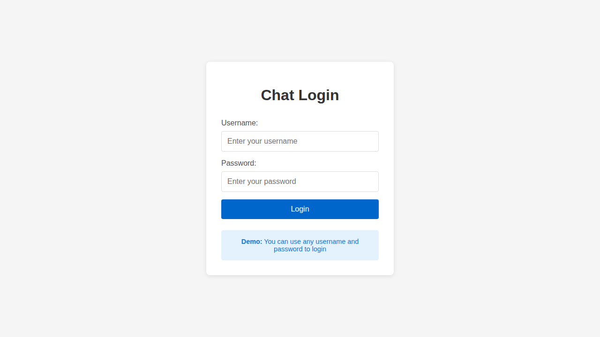
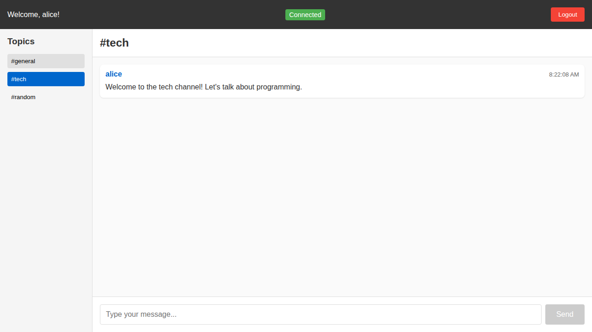

# Centrifuge Chat Application

A real-time topic-based messaging application built with:
- **Centrifuge Go Library** - Integrated real-time messaging within Go backend
- **Go Backend** - JWT authentication, API endpoints, and WebSocket server  
- **SvelteKit Frontend** - Modern web interface

## Screenshots

### Login Page


### Chat Interface with Real-time Messaging


## Architecture

```
├── backend/        # Go server with integrated Centrifuge, JWT auth, and WebSocket
├── frontend/       # SvelteKit web application
└── README.md
```

The application now uses a simplified two-tier architecture where the Centrifuge library is directly integrated into the Go backend, eliminating the need for a separate Centrifuge server.

## Quick Start

### 1. Start Go Backend

```bash
cd backend
go run main.go
```

The server provides:
- API endpoints at http://localhost:3001
- WebSocket endpoint at ws://localhost:3001/connection/websocket

### 2. Start Frontend

```bash
cd frontend
npm install
npm run dev
```

The web application will be available at http://localhost:5173

## Features

- **Real-time messaging** via integrated Centrifuge WebSocket server
- **Topic-based channels** (general, tech, random)
- **JWT authentication** with secure token generation
- **Persistent login** with localStorage
- **Responsive UI** with modern design
- **Multi-user support** with live message updates
- **Simplified deployment** with integrated architecture

## Demo Usage

1. Open http://localhost:5173 in your browser
2. Login with any username/password (demo mode)
3. Select a topic from the sidebar
4. Start chatting in real-time!

You can open multiple browser tabs/windows to test multi-user functionality.

## API Endpoints

- `POST /api/login` - User authentication
- `GET /api/user` - Get user information (protected)
- `GET /api/health` - Health check
- `ws://localhost:3001/connection/websocket` - WebSocket endpoint for real-time messaging

## Configuration

### Backend
- Port: 3001  
- JWT Secret: `jwt-secret-key`
- Integrated Centrifuge with configurable channels
- CORS enabled for localhost:5173

### Frontend
- Port: 5173 (dev mode)
- Connects to backend API at http://localhost:3001
- Connects to WebSocket at ws://localhost:3001/connection/websocket

## Development

The simplified architecture allows for easier development:

- **Backend**: Standard Go development with integrated Centrifuge library
- **Frontend**: SvelteKit with hot reload and TypeScript support
- **Single token authentication**: No separate Centrifuge tokens needed

## Production Notes

For production deployment:
1. Use environment variables for secrets
2. Configure proper CORS settings
3. Use HTTPS/WSS connections
4. Set up proper authentication database
5. Configure reverse proxy (nginx/traefik)
6. Consider scaling with Redis broker for multi-node deployments